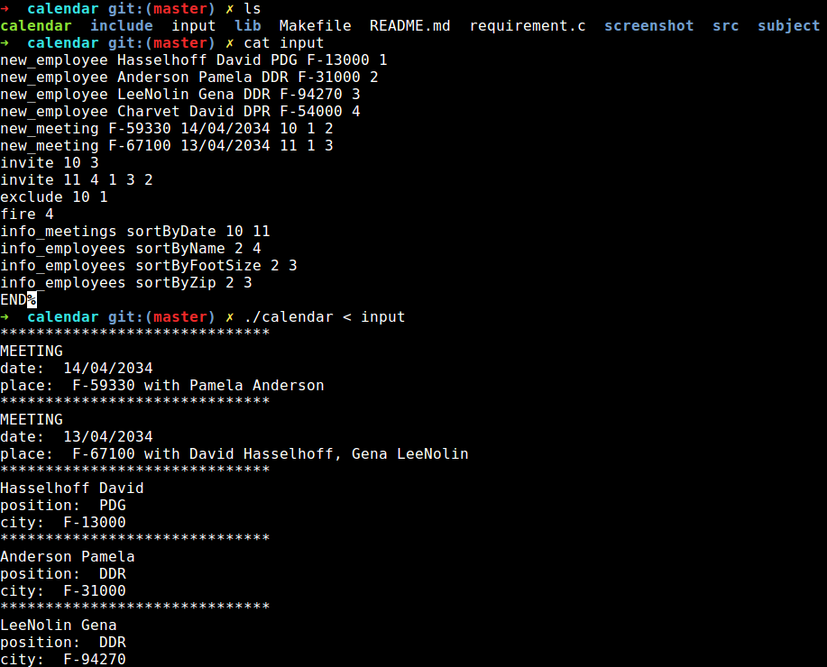

# calendar
Epitech first year project : calendar

Deadline : 5 days

Beginning of the project : 30/06/2016, 08h42

Group size : 1 person

# calendar

The goal of this project is to create a professional calendar, including employees and meetings management.

The program reads instructions on the standard input.

The authorized instructions are:

1. new_employee name forename job zipcode id

2. new_meeting place date id idEmployee1 idEmployee2 [idEmployee3 ....]

3. invite idMeeting idEmployee1 [idEmployee2 ....]

4. exclude idMeeting idEmployee1 [idEmployee2 ....]

5. info_employees sortByE [idEmployee1 ....]

6. info_meetings sortByM [idMeeting1 ....]

7. cancel idMeeting1 [idMeeting2 ....]

8. fire idEmployee1 [idEmployee2 ....]

9. END


## Getting started

These instructions will allow you to obtain a copy of the operational project on your local machine for development and testing purposes.

### Prerequisites

What do you need to install the software and how to install it?

```
gcc
make
```

### Installation

Here's how to start the project on your computer

Clone and go in the directory calendar

Project compilation

```
make
```

Running project

```
./calendar -h
```


## Screenshot



## Build with

* [C](https://en.wikipedia.org/wiki/C_(programming_language))

## Auteurs

* **David Munoz** - [DavidMunoz-dev](https://github.com/davidmunoz-dev)
